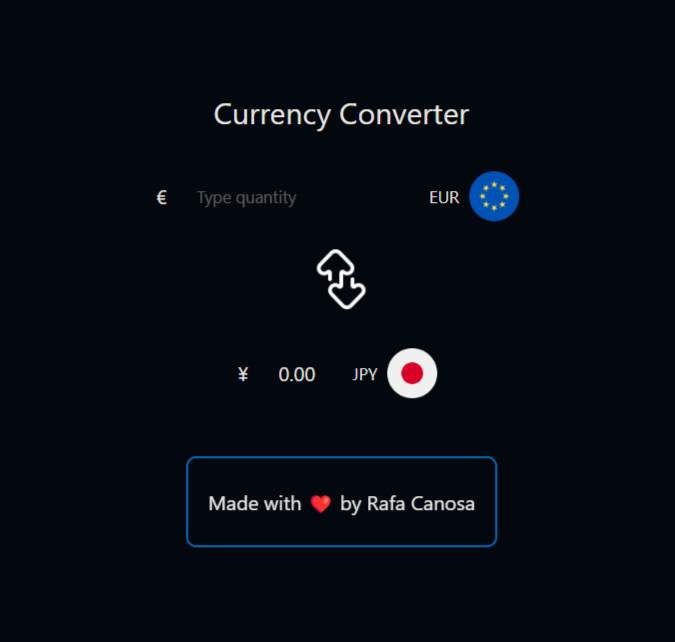

# Currency Converter App

This is a simple Currency Converter web application built with React and native CSS. It allows users to convert between different currencies using real-time exchange rates fetched from a third-party API. This README provides an overview of the app, its features, and instructions for setting it up and running it on your local machine.



## Features

- **Currency Conversion**: Easily convert between various currencies, including major global currencies.
- **Real-time Exchange Rates**: Utilizes a reliable third-party API to provide up-to-date exchange rate information.
- **User-friendly Interface**: Clean and intuitive design for a seamless user experience.
- **Responsive Design**: Ensures a consistent and user-friendly experience across different devices and screen sizes.

## Getting Started

Follow these instructions to get a copy of the project up and running on your local machine.

### Tools
- React.js
- Native CSS
- [Public api for the currencies](https://github.com/fawazahmed0/currency-api#readme)

### Prerequisites

- [Node.js](https://nodejs.org/) installed on your machine
- [npm](https://www.npmjs.com/) (Node Package Manager) or [yarn](https://yarnpkg.com/) installed

## Live Demo 

Check out the live demo of the Currency Converter App [here](https://currency-converter-nu-eight.vercel.app/).

## Installation

1. Clone the repository to your local machine:

   ```shell
   git clone https://github.com/Rafacv23/currency-converter-app.git

Happy hacking! 🌍💱
